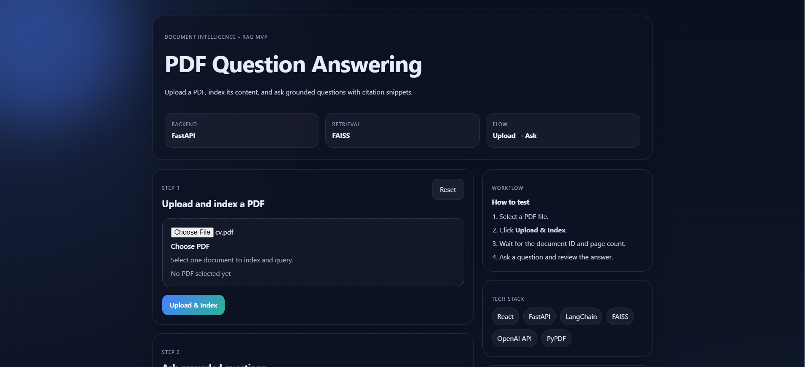
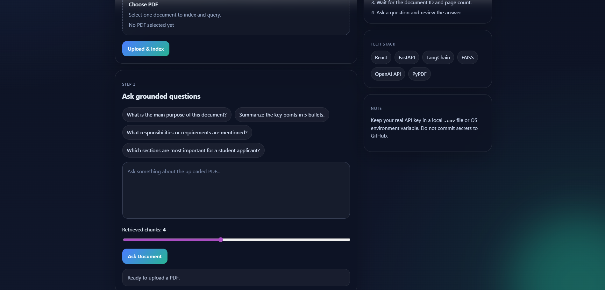

# 📄 PDF Question Answering Web App

A full-stack document intelligence application that allows users to upload PDF files, index their content, and ask grounded questions using Retrieval-Augmented Generation (RAG).

---

## 🚀 Overview

This project demonstrates how to build a real-world AI system that combines:

- Document processing
- Vector search (FAISS)
- Large Language Models (LLMs)
- Full-stack development (FastAPI + React)

Users can upload a PDF and ask questions, and the system returns answers based on the document content.

---

## ✨ Features

- Upload and index PDF documents
- Extract and preprocess text from PDFs
- Chunk document content for retrieval
- Generate embeddings and store them in FAISS
- Ask context-aware questions about the document
- Retrieve relevant chunks and generate grounded answers
- Modern React frontend with interactive UI

---

## 🧠 How It Works

1. User uploads a PDF
2. Backend extracts text using PyPDF
3. Text is split into chunks
4. Embeddings are generated using OpenAI
5. FAISS stores the embeddings
6. User asks a question
7. System retrieves relevant chunks
8. LLM generates a grounded answer

---

## 🛠 Tech Stack

### Backend
- FastAPI
- LangChain
- OpenAI API
- FAISS
- PyPDF

### Frontend
- React
- Vite
- CSS

---

## 📁 Project Structure

backend/
├── app/
│ └── main.py
├── requirements.txt

frontend/
├── src/
├── public/
├── package.json

README.md

---

## ⚙️ Setup Instructions

### 🔹 Backend

bash
cd backend
pip install -r requirements.txt

Create .env file:

OPENAI_API_KEY=your_openai_api_key_here

Run backend:

python -m uvicorn app.main:app --reload
🔹 Frontend
cd frontend
npm install
npm run dev
▶️ Usage
Open the frontend in your browser
Upload a PDF file
Wait for indexing
Ask questions about the document
Review the generated answers
🔒 Security Note
Do NOT upload your .env file to GitHub
Keep your API keys private
Use .env.example for sharing configuration
📌 Future Improvements
Highlight answer sources in UI
Multi-document support
Chat history
Authentication system
Deployment (Docker / cloud)

## 📸 Demo

### Upload Step

### Ask Question

👤 Author
Danyal Hendousinabad
